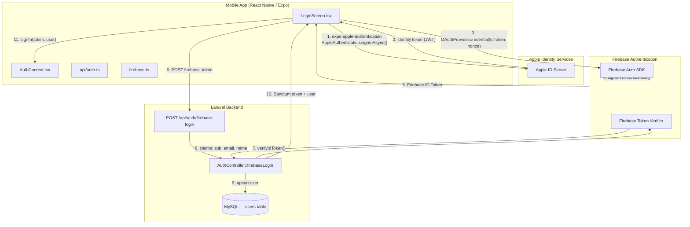
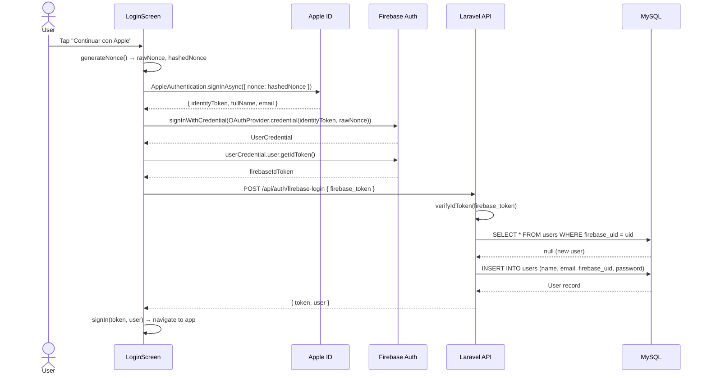
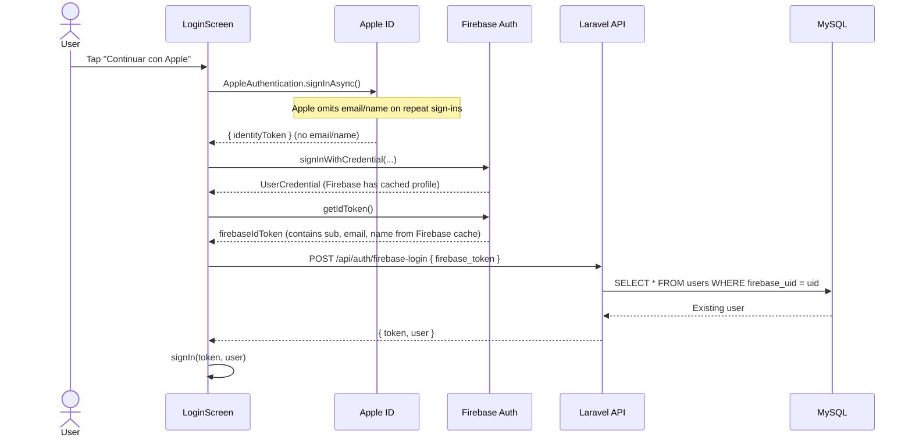
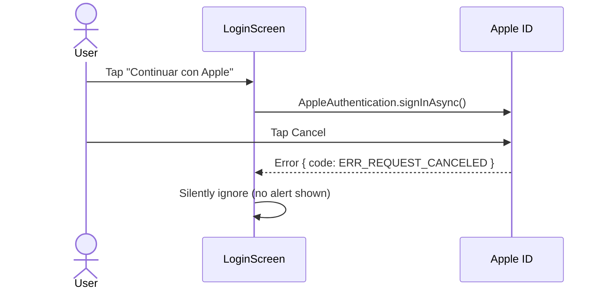

# Design Document: Sign In with Apple

## Overview

Sign In with Apple adds Apple's native OAuth provider as a third authentication option in the Lectura (gRafé) mobile app, sitting alongside the existing email/password and Google Sign-In flows. The implementation follows the same pattern already established for Google: the mobile app obtains an Apple credential, exchanges it for a Firebase ID token via `signInWithCredential`, then sends that Firebase ID token to the Laravel backend's existing `/api/auth/firebase-login` endpoint to receive a Sanctum token.

Because the backend already handles any Firebase-verified token generically (it reads `sub`, `email`, and `name` from the JWT claims), **no backend code changes are required**. All new code lives in the mobile app.

---

## Architecture



---

## Sequence Diagrams

### Happy Path — New Apple User



### Happy Path — Returning Apple User



### Error Path — User Cancels



---

## Components and Interfaces

### Component 1: `LoginScreen.tsx` (modified)

**Purpose**: Renders the sign-in UI and orchestrates the Apple Sign-In flow.

**New responsibilities**:
- Import and call `AppleAuthentication.signInAsync()`
- Generate a cryptographic nonce for replay-attack prevention
- Construct the Firebase `OAuthProvider` credential from Apple's identity token
- Render the Apple Sign-In button (conditionally, iOS only)

**Interface** (new handler added to existing component):

```typescript
// New handler added to LoginScreen
async function handleAppleSignIn(): Promise<void>

// Nonce utility (can live in a shared util file)
function generateNonce(): { rawNonce: string; hashedNonce: string }
```

### Component 2: `AuthContext.tsx` (no changes required)

**Purpose**: Manages auth state. The existing `signIn(token, user)` method is reused as-is — Apple Sign-In calls it the same way Google Sign-In does.

### Component 3: `api/auth.ts` (no changes required)

**Purpose**: The existing `firebaseLogin(idToken)` function is reused as-is.

### Component 4: `firebase.ts` (minor addition)

**Purpose**: Firebase app initialization. Needs the Apple OAuth provider configured.

**Addition**:
```typescript
import { OAuthProvider } from 'firebase/auth';
export const appleProvider = new OAuthProvider('apple.com');
```

### Component 5: `AuthController.php` (no changes required)

**Purpose**: The existing `firebaseLogin()` method already handles any Firebase-verified token regardless of the upstream provider. Apple tokens flow through Firebase, so the backend sees a standard Firebase JWT with `sub`, `email`, and `name` claims — identical to Google tokens.

---

## Data Models

### Mobile: `AppleSignInCredential`

```typescript
// Returned by expo-apple-authentication
interface AppleAuthenticationCredential {
  user: string;                    // Stable Apple user ID (opaque)
  identityToken: string | null;    // Signed JWT from Apple
  authorizationCode: string | null;
  email: string | null;            // Only present on FIRST sign-in
  fullName: AppleAuthenticationFullName | null; // Only on FIRST sign-in
  realUserStatus: AppleAuthenticationUserDetectionStatus;
  state: string | null;
}
```

### Mobile: `NoncePayload`

```typescript
interface NoncePayload {
  rawNonce: string;    // Random 32-char hex string, sent to Firebase
  hashedNonce: string; // SHA-256 of rawNonce, sent to Apple
}
```

### Backend: `users` table (existing — no migration needed)

| Column | Type | Notes |
|---|---|---|
| `id` | bigint PK | |
| `name` | varchar | Synced from Firebase claims |
| `email` | varchar unique | Synced from Firebase claims |
| `firebase_uid` | varchar unique nullable | Apple UID stored here (same as Google) |
| `password` | varchar | Random bcrypt hash for social-only users |
| `settings` | text | JSON, existing |
| `expo_push_token` | varchar nullable | Existing |

**No new columns or migrations are needed.** Apple users are stored identically to Google users — the `firebase_uid` column holds the Firebase UID (which Firebase derives from the Apple user ID).

---

## Error Handling

### Error Scenario 1: User Cancels Apple Sheet

**Condition**: User taps "Cancel" in the Apple authentication sheet.  
**Response**: `expo-apple-authentication` throws an error with `code === 'ERR_REQUEST_CANCELED'`.  
**Recovery**: Silently catch and return — no alert, no state change. Matches the existing Google Sign-In cancel behavior.

### Error Scenario 2: Apple Not Available (Android / Expo Go)

**Condition**: `AppleAuthentication.isAvailableAsync()` returns `false`, or the module is not installed.  
**Response**: The Apple button is not rendered. On Android, the button is hidden entirely.  
**Recovery**: No action needed — the button simply doesn't appear.

### Error Scenario 3: Missing Identity Token

**Condition**: Apple returns a credential but `identityToken` is `null` (should not happen in practice).  
**Response**: Early return from the handler, show a generic error alert.  
**Recovery**: User can retry.

### Error Scenario 4: Firebase Credential Exchange Fails

**Condition**: `signInWithCredential()` throws (e.g., token expired, Firebase misconfiguration).  
**Response**: Show alert "No se pudo iniciar sesión con Apple. Inténtalo de nuevo."  
**Recovery**: User can retry.

### Error Scenario 5: Backend Returns 401

**Condition**: Firebase token is invalid or expired by the time it reaches Laravel.  
**Response**: The existing Axios interceptor in `client.ts` handles 401s by clearing the token and calling `signOut()`.  
**Recovery**: User is returned to the login screen.

---

## Testing Strategy

### Unit Testing Approach

- Test `generateNonce()` to verify it produces a 32-char hex raw nonce and a valid SHA-256 hex hash.
- Test that `handleAppleSignIn` calls `signIn(token, user)` on success.
- Test that cancellation (`ERR_REQUEST_CANCELED`) does not trigger an alert or state change.
- Mock `expo-apple-authentication`, `firebase/auth`, and `api/auth` modules.

### Property-Based Testing Approach

Not applicable for this feature — the auth flow is a fixed sequence of side-effectful calls rather than a pure function with a large input space.

### Integration Testing Approach

- Manual end-to-end test on a physical iOS device (Apple Sign-In requires real hardware).
- Verify first sign-in creates a new user in the database with `firebase_uid` populated.
- Verify repeat sign-in returns the same user record.
- Verify sign-out clears the Sanctum token and Firebase session.

### Backend Testing (Pest)

No new backend tests are needed since `AuthController::firebaseLogin` is unchanged. The existing Firebase login tests cover the code path.

---

## Security Considerations

- **Nonce**: A SHA-256 hashed nonce is passed to Apple and the raw nonce to Firebase. This prevents replay attacks where an intercepted Apple identity token could be reused.
- **Token lifetime**: Apple identity tokens are short-lived (~10 minutes). Firebase exchanges them immediately, so the window for interception is minimal.
- **Email privacy relay**: Apple may provide a relay email (`@privaterelay.appleid.com`) instead of the real email. The backend stores whatever email Firebase provides — this is acceptable since the app uses Firebase UID as the primary identity key, not email.
- **Android**: The Apple Sign-In button must not be shown on Android. `AppleAuthentication.isAvailableAsync()` returns `false` on Android, so the conditional render handles this automatically.
- **App Store requirement**: Apple mandates that any app offering third-party social sign-in (Google) must also offer Sign In with Apple. This feature satisfies that requirement.

---

## Performance Considerations

- The Apple authentication sheet is a native OS modal — no performance impact on the app.
- The nonce generation uses `expo-crypto` (SHA-256) which is synchronous and negligible in cost.
- No additional network round-trips are introduced beyond what Google Sign-In already does.

---

## Dependencies

| Package | Version | Purpose |
|---|---|---|
| `expo-apple-authentication` | `~7.x` (Expo 54 compatible) | Native Apple Sign-In sheet |
| `expo-crypto` | `~14.x` (Expo 54 compatible) | SHA-256 nonce hashing |
| `firebase/auth` `OAuthProvider` | Already installed (firebase ^12) | Build Apple credential for Firebase |

Both `expo-apple-authentication` and `expo-crypto` are first-party Expo packages and do not require ejecting from the managed workflow. They must be added to `app.json` plugins and installed via `npx expo install`.

---

## Correctness Properties

### Property 1: Nonce integrity

For any generated nonce pair, the hashed value is the SHA-256 of the raw value.

```typescript
assert(sha256(rawNonce) === hashedNonce)
```

### Property 2: Nonce uniqueness

Two independently generated nonces are different with overwhelming probability (32 hex chars = 128 bits of entropy).

```typescript
const a = await generateNonce();
const b = await generateNonce();
assert(a.rawNonce !== b.rawNonce);
assert(a.hashedNonce !== b.hashedNonce);
```

### Property 3: Cancel is silent

If Apple returns `ERR_REQUEST_CANCELED`, no alert is shown and `isLoading` resets to `false`.

```typescript
// err.code === 'ERR_REQUEST_CANCELED' → no Alert.alert call, isLoading === false
assert(onCancel => alertNotShown && isLoading === false)
```

### Property 4: Auth state consistency

After a successful Apple sign-in, the auth context reflects the authenticated user.

```typescript
assert(afterSignIn => isAuthenticated === true && user !== null && token !== null)
```

### Property 5: Button visibility

The Apple button is only rendered when `isAvailableAsync()` returns `true` (iOS only).

```typescript
assert(appleAvailable === false => appleButtonNotRendered)
```

### Property 6: Backend compatibility

The `firebaseLogin` API call shape is identical regardless of whether the upstream provider is Google or Apple — both produce a Firebase ID token sent as `firebase_token`.

```typescript
assert(
  typeof firebaseLogin(appleFirebaseIdToken) === typeof firebaseLogin(googleFirebaseIdToken)
)
```

---

## Low-Level Design

### Key Functions with Formal Specifications

#### `generateNonce(): NoncePayload`

```typescript
import * as Crypto from 'expo-crypto';

async function generateNonce(): Promise<NoncePayload> {
  const rawNonce = Array.from(
    { length: 32 },
    () => Math.floor(Math.random() * 16).toString(16)
  ).join('');

  const hashedNonce = await Crypto.digestStringAsync(
    Crypto.CryptoDigestAlgorithm.SHA256,
    rawNonce
  );

  return { rawNonce, hashedNonce };
}
```

**Preconditions:**
- `expo-crypto` module is available
- Runtime is iOS or Android (not web)

**Postconditions:**
- `rawNonce` is a 32-character lowercase hex string
- `hashedNonce` is the SHA-256 digest of `rawNonce` as a lowercase hex string
- `rawNonce !== hashedNonce` (with overwhelming probability)

#### `handleAppleSignIn(): Promise<void>`

```typescript
import * as AppleAuthentication from 'expo-apple-authentication';
import { OAuthProvider, signInWithCredential } from 'firebase/auth';
import { firebaseAuth } from '../firebase';
import { firebaseLogin } from '../api/auth';

async function handleAppleSignIn(): Promise<void> {
  setIsLoading(true);
  try {
    const { rawNonce, hashedNonce } = await generateNonce();

    const appleCredential = await AppleAuthentication.signInAsync({
      requestedScopes: [
        AppleAuthentication.AppleAuthenticationScope.FULL_NAME,
        AppleAuthentication.AppleAuthenticationScope.EMAIL,
      ],
      nonce: hashedNonce,
    });

    if (!appleCredential.identityToken) {
      throw new Error('Apple did not return an identity token');
    }

    const provider = new OAuthProvider('apple.com');
    const oauthCredential = provider.credential({
      idToken: appleCredential.identityToken,
      rawNonce,
    });

    const userCredential = await signInWithCredential(firebaseAuth, oauthCredential);
    const firebaseIdToken = await userCredential.user.getIdToken();

    const { token, user } = await firebaseLogin(firebaseIdToken);
    await signIn(token, user);
  } catch (err: any) {
    if (err.code === 'ERR_REQUEST_CANCELED') {
      return; // User cancelled — no alert
    }
    Alert.alert('Error', 'No se pudo iniciar sesión con Apple. Inténtalo de nuevo.');
  } finally {
    setIsLoading(false);
  }
}
```

**Preconditions:**
- `AppleAuthentication.isAvailableAsync()` returned `true` before rendering the button
- `firebaseAuth` is initialized
- Network is available

**Postconditions:**
- On success: `signIn(token, user)` is called, user is navigated to the app
- On `ERR_REQUEST_CANCELED`: no state change, no alert
- On any other error: alert is shown, `isLoading` is reset to `false`
- `isLoading` is always reset to `false` in the `finally` block

**Loop Invariants:** N/A (no loops)

---

### Algorithmic Pseudocode

#### Main Apple Sign-In Flow

```pascal
PROCEDURE handleAppleSignIn()
  INPUT: none (uses component state and context)
  OUTPUT: side effects — auth state updated or error shown

  SEQUENCE
    setIsLoading(true)

    TRY
      { rawNonce, hashedNonce } ← generateNonce()

      appleCredential ← AppleAuthentication.signInAsync({
        requestedScopes: [FULL_NAME, EMAIL],
        nonce: hashedNonce
      })

      IF appleCredential.identityToken IS NULL THEN
        THROW Error("No identity token")
      END IF

      oauthCredential ← OAuthProvider('apple.com').credential({
        idToken: appleCredential.identityToken,
        rawNonce: rawNonce
      })

      userCredential ← signInWithCredential(firebaseAuth, oauthCredential)
      firebaseIdToken ← userCredential.user.getIdToken()

      { token, user } ← POST /api/auth/firebase-login { firebase_token: firebaseIdToken }

      signIn(token, user)   // updates AuthContext, triggers navigation

    CATCH err
      IF err.code = 'ERR_REQUEST_CANCELED' THEN
        RETURN  // silent — user chose to cancel
      ELSE
        Alert.alert("Error", "No se pudo iniciar sesión con Apple...")
      END IF

    FINALLY
      setIsLoading(false)
    END TRY
  END SEQUENCE
END PROCEDURE
```

#### Nonce Generation

```pascal
PROCEDURE generateNonce()
  INPUT: none
  OUTPUT: { rawNonce: String, hashedNonce: String }

  SEQUENCE
    rawNonce ← ""
    FOR i FROM 1 TO 32 DO
      rawNonce ← rawNonce + randomHexChar()
    END FOR

    hashedNonce ← SHA256(rawNonce)

    RETURN { rawNonce, hashedNonce }
  END SEQUENCE
END PROCEDURE
```

---

### LoginScreen Changes — Apple Button Rendering

```typescript
// At the top of LoginScreen, alongside the Google availability check:
import * as AppleAuthentication from 'expo-apple-authentication';

// Inside the component:
const [appleAvailable, setAppleAvailable] = useState(false);

useEffect(() => {
  AppleAuthentication.isAvailableAsync().then(setAppleAvailable);
}, []);

// In the JSX, after the Google button:
{appleAvailable && (
  <AppleAuthentication.AppleAuthenticationButton
    buttonType={AppleAuthentication.AppleAuthenticationButtonType.SIGN_IN}
    buttonStyle={AppleAuthentication.AppleAuthenticationButtonStyle.BLACK}
    cornerRadius={Radii.lg}
    style={styles.appleBtn}
    onPress={handleAppleSignIn}
  />
)}
```

**Style addition:**
```typescript
appleBtn: {
  width: '100%',
  height: 50,
  marginTop: 12,
},
```

---

### `app.json` Changes

```json
{
  "expo": {
    "plugins": [
      "expo-apple-authentication",
      "expo-secure-store",
      "expo-web-browser",
      "@react-native-google-signin/google-signin",
      "./plugins/withYouVersionQuery",
      ["expo-notifications", { "icon": "./assets/notification-icon.png", "color": "#ffffff" }],
      "@react-native-community/datetimepicker"
    ]
  }
}
```

---

### Firebase Console Configuration

Apple Sign-In must be enabled as a provider in the Firebase project:

1. Firebase Console → Authentication → Sign-in method → Apple → Enable
2. Set the **Services ID** (e.g., `org.reydereyestotonicapan.grafe.apple`) — created in Apple Developer portal
3. Set the **OAuth redirect domain** to `bible-reading-quiz.firebaseapp.com` (already the `authDomain`)
4. Upload the **Apple private key** (`.p8` file) with the Key ID and Team ID

### Apple Developer Portal Configuration

1. Enable **Sign In with Apple** capability for the App ID `org.reydereyestotonicapan.grafe`
2. Create a **Services ID** for the web OAuth redirect (used by Firebase)
3. Create a **Key** with Sign In with Apple enabled (download `.p8` for Firebase)

---

### Example Usage — Complete Flow

```typescript
// LoginScreen.tsx — simplified illustration of the complete integration

import * as AppleAuthentication from 'expo-apple-authentication';
import * as Crypto from 'expo-crypto';
import { OAuthProvider, signInWithCredential } from 'firebase/auth';
import { firebaseAuth } from '../firebase';
import { firebaseLogin } from '../api/auth';
import { useAuth } from '../auth/AuthContext';

// 1. Check availability on mount
const [appleAvailable, setAppleAvailable] = useState(false);
useEffect(() => {
  AppleAuthentication.isAvailableAsync().then(setAppleAvailable);
}, []);

// 2. Generate nonce
async function generateNonce() {
  const rawNonce = Array.from({ length: 32 }, () =>
    Math.floor(Math.random() * 16).toString(16)
  ).join('');
  const hashedNonce = await Crypto.digestStringAsync(
    Crypto.CryptoDigestAlgorithm.SHA256,
    rawNonce
  );
  return { rawNonce, hashedNonce };
}

// 3. Handle sign-in
async function handleAppleSignIn() {
  setIsLoading(true);
  try {
    const { rawNonce, hashedNonce } = await generateNonce();
    const appleCredential = await AppleAuthentication.signInAsync({
      requestedScopes: [
        AppleAuthentication.AppleAuthenticationScope.FULL_NAME,
        AppleAuthentication.AppleAuthenticationScope.EMAIL,
      ],
      nonce: hashedNonce,
    });
    if (!appleCredential.identityToken) throw new Error('No identity token');
    const oauthCredential = new OAuthProvider('apple.com').credential({
      idToken: appleCredential.identityToken,
      rawNonce,
    });
    const userCredential = await signInWithCredential(firebaseAuth, oauthCredential);
    const firebaseIdToken = await userCredential.user.getIdToken();
    const { token, user } = await firebaseLogin(firebaseIdToken);
    await signIn(token, user);
  } catch (err: any) {
    if (err.code !== 'ERR_REQUEST_CANCELED') {
      Alert.alert('Error', 'No se pudo iniciar sesión con Apple. Inténtalo de nuevo.');
    }
  } finally {
    setIsLoading(false);
  }
}

// 4. Render button (iOS only, when available)
{appleAvailable && (
  <AppleAuthentication.AppleAuthenticationButton
    buttonType={AppleAuthentication.AppleAuthenticationButtonType.SIGN_IN}
    buttonStyle={AppleAuthentication.AppleAuthenticationButtonStyle.BLACK}
    cornerRadius={Radii.lg}
    style={{ width: '100%', height: 50, marginTop: 12 }}
    onPress={handleAppleSignIn}
  />
)}
```


